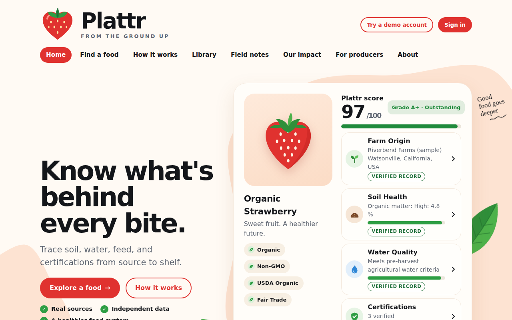
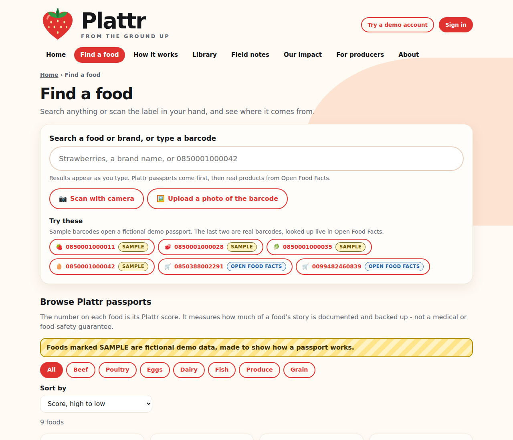
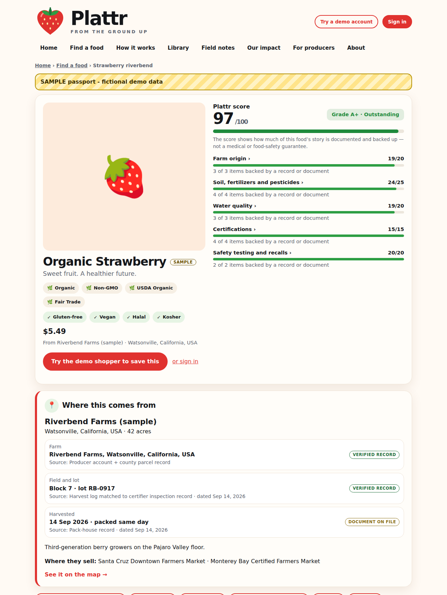
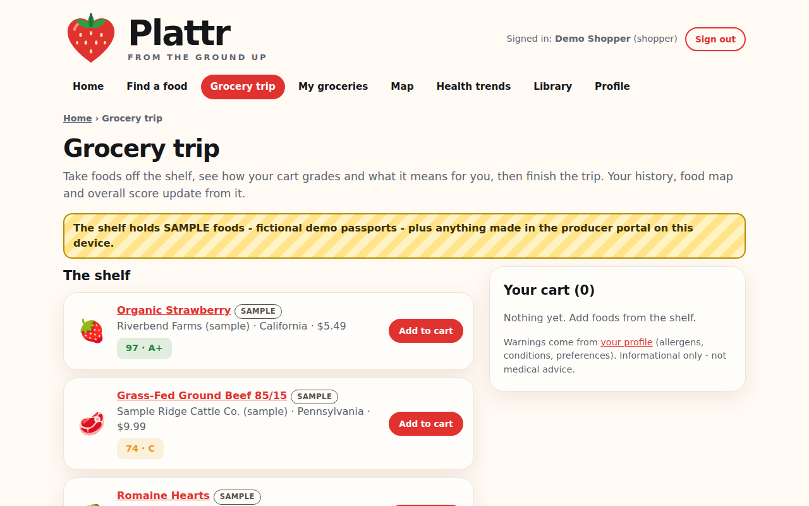
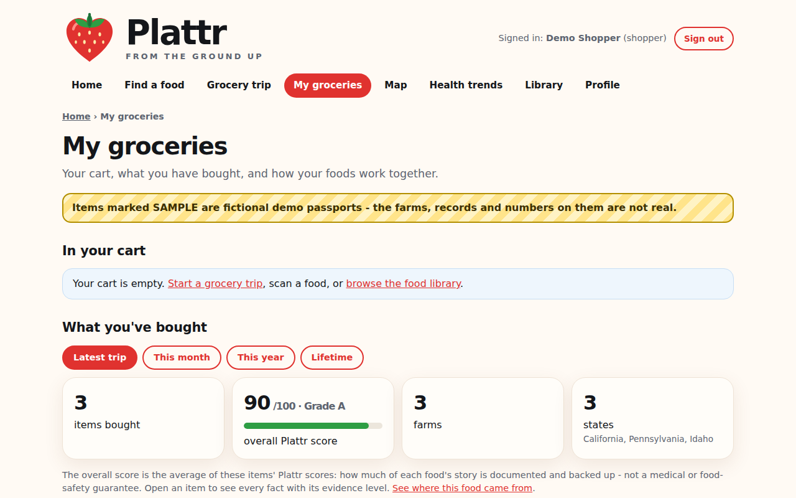
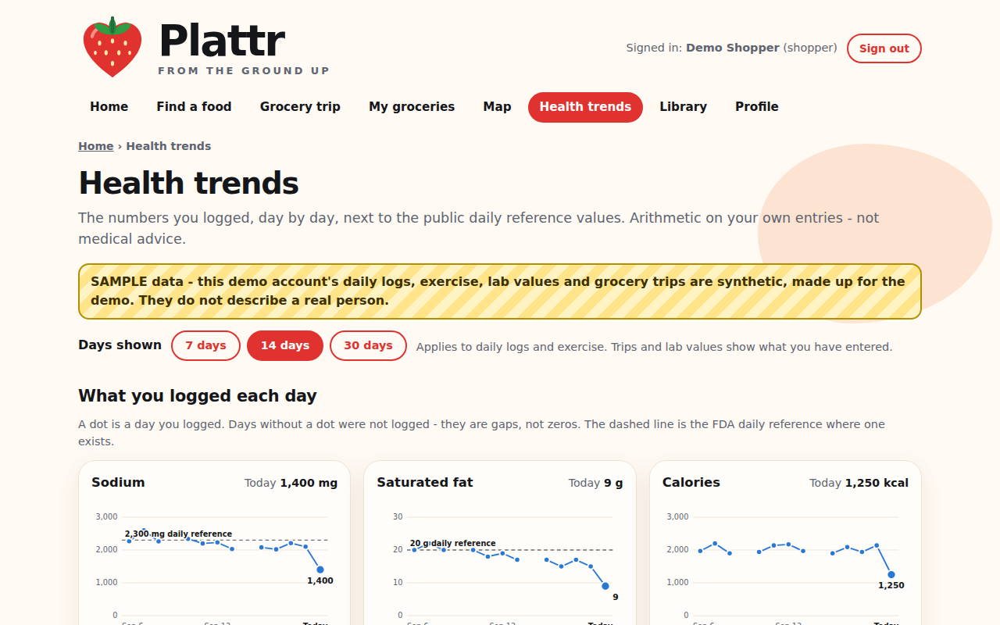
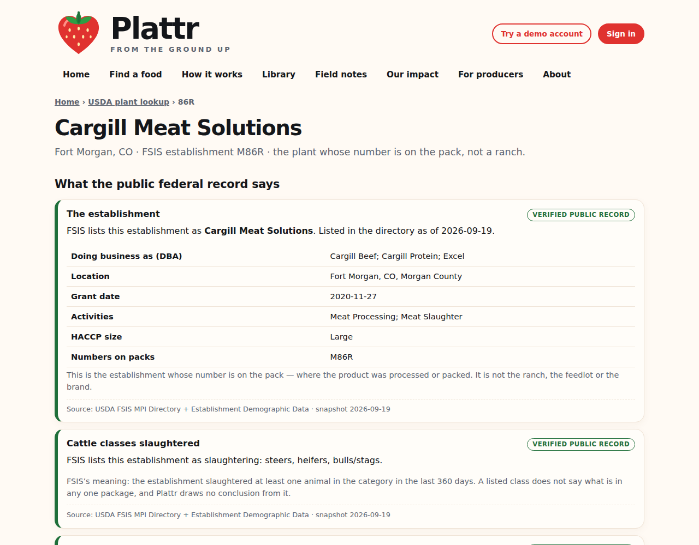
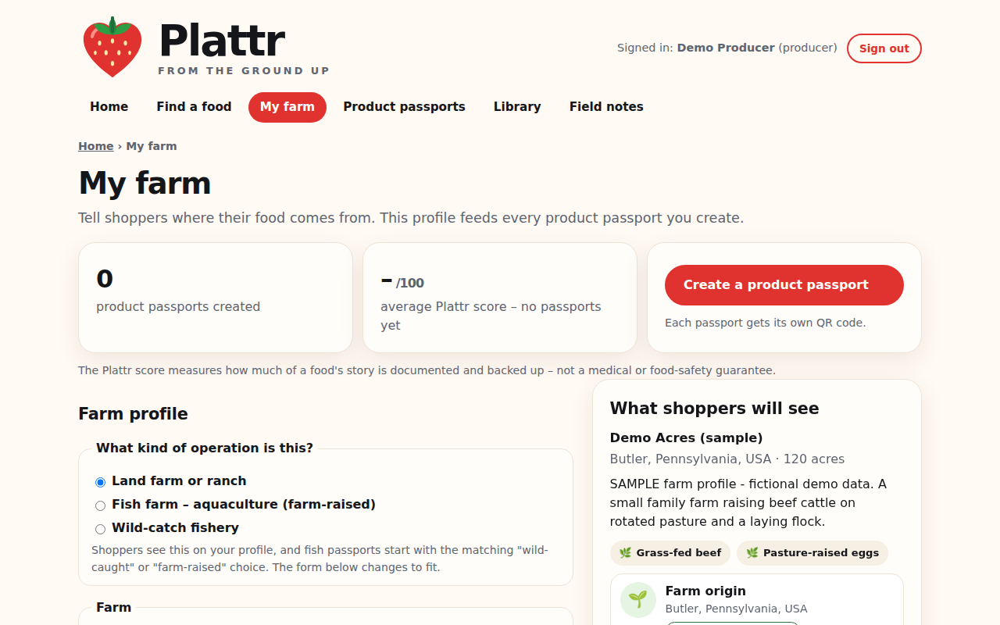
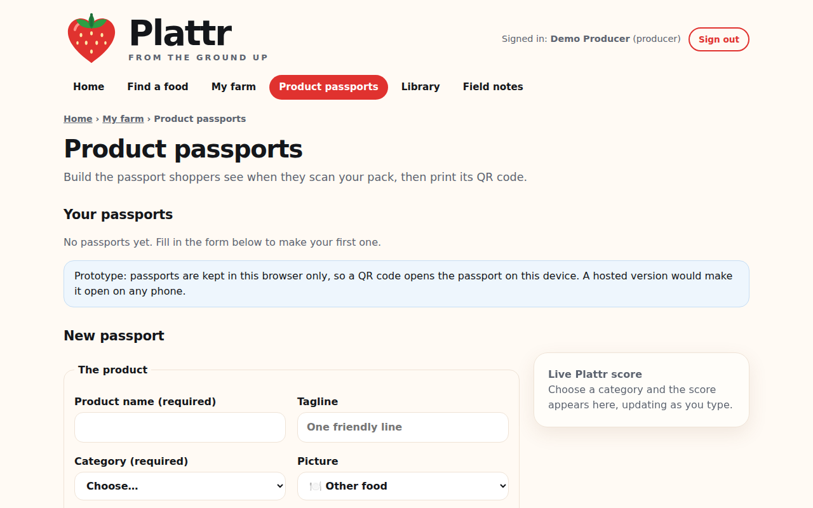

# Plattr

**Know what's behind every bite.**

**Live app: [[plattr-parthd25s-projects.vercel.app](https://plattr.replit.app)](https://plattr.replit.app)** · one-click demo accounts at `/demo-account`

Scan a food's QR code or barcode and read its **product passport**: farm origin, soil, water, feed, welfare, animal health, certifications, safety testing, a hazard outlook for the region, and nutrition. Every passport gets a transparent 0-100 **Plattr score** (A+ to F), and every fact carries a text label saying how well it is backed up, so a producer's own claim never passes as a verified record.

Plattr is a student prototype (HackCMU 2026). **The product passports in the demo are fictional SAMPLE data.**



## For shoppers

- **Find a food** (`/explore`): search a name, brand or barcode, scan with the camera, or upload a photo. Results mix Plattr passports with live Open Food Facts records, labelled **Community record**.
- **Read the passport** (`/food/:id`): every fact shows an evidence chip - **Verified record**, **Document on file**, **Producer-declared** or **Not provided** - plus the score broken down section by section, a hazard outlook, nutrition facts and personal notes.
- **Profile** (`/profile`): allergens, health conditions, dietary preferences, optional lab values and today's intake. Warnings are deterministic, on-device and informational only, never medical advice.
- **Grocery trip** (`/shop`) and **My groceries** (`/history`): build a cart, see its running score and grade, finish the trip and keep a history with an overall score per timeframe.
- **Map** (`/map`): the farms behind what you bought, with distances from your location (which never leaves the browser).
- **Health trends** (`/trends`): logged intake charted over 7 to 90 days against FDA Daily Values. Unlogged days are gaps, never zeros.
- **USDA plant lookup** (`/plant-lookup`, `/est/:number`): the real federal record behind the establishment number on a meat pack.

| Find a food | Product passport |
|---|---|
|  |  |

| Grocery trip | My groceries |
|---|---|
|  |  |

| Health trends | USDA plant lookup |
|---|---|
|  |  |

## For producers

- **My farm** (`/producer`): location, acreage, herd, water tests, fertilizers and pesticides, health records and a parasite watch list. Land farms, fish farms and wild-catch fisheries are all supported.
- **Product passports** (`/producer/passports`): fill in the sections, watch the score update live, and get a **QR code** that opens the passport. Producer entries show as **Producer-declared** or **Document on file** and earn half the points of a verified record. Nothing is uploaded or inspected in this prototype.

| My farm | Passport builder |
|---|---|
|  |  |

## How the score works

The score measures **how much of a food's story is documented and backed up**. It is not a food-safety or health guarantee. One pure function, [`src/passport/score.ts`](src/passport/score.ts), does the work and every part is shown on screen.

| Evidence chip | Weight |
|---|---|
| Verified record | 1.0 |
| Document on file | 0.9 |
| Producer-declared / Community record | 0.5 |
| Not provided | 0 |

Each section earns its average weight times its maximum points (farm origin 20; feed, welfare and animal health 15 each for animal products; soil 25 and water 20 for plant products; certifications and safety testing fill the rest to 100). Grades: A+ 97-100 · A 90-96 · B 80-89 · C 70-79 · D 60-69 · F below 60. The full rubric is on `/how-it-works`.

## Real vs sample

- **Real:** USDA FSIS plant directory, recalls, sampling and humane-handling data behind the plant lookup (snapshots in [`public/data`](public/data)); regulation quotes behind label claims; FDA Daily Values and the cited reference values in [`src/health/references.ts`](src/health/references.ts).
- **Sample:** the nine passports, their farms, the rancher profiles and the two demo accounts are fictional and marked SAMPLE on screen. Hazard notes are general background, not findings about any farm.
- **Storage:** accounts, profiles, carts and producer passports live only in this browser's `localStorage`. No server, no real auth. Do not enter a real password or real medical data.

The health layer's design reasoning is in [`docs/HEALTH-ARCHITECTURE.md`](docs/HEALTH-ARCHITECTURE.md).

## Run it

```sh
npm install
npm run dev      # Vite dev server
npm test         # Vitest
npm run build    # type-check, then production build into dist/
npm run start    # serve the production build on $PORT or 4173
```

Needs a current Node.js LTS. No environment variables or secrets. To deploy on Replit, import the repo and the included [`.replit`](.replit) file does the rest; for a static host, publish `dist/`.

## Tech stack

Vite + React + TypeScript, react-router, plain CSS · Leaflet with OpenStreetMap tiles · qrcode · @zxing/browser for barcode decoding · Vitest · Vercel static hosting with cookie-free Web Analytics. Everything runs in the browser over static JSON in `public/data`. No backend and no LLM.

## Data sources

USDA FSIS (inspection directory, recalls, sampling, humane handling, labeling guidance) · FDA (food substances, GRAS, color additives, Daily Values) · eCFR and Federal Register · European Commission DG SANTE and EUR-Lex · Open Food Facts ([ODbL](https://opendatacommons.org/licenses/odbl/1-0/)) · [OpenStreetMap](https://www.openstreetmap.org/copyright) contributors.

The research notes, raw source files and the scripts that built `public/data` live in the team's private working repository. A production PostgreSQL traceability schema is designed but not part of this repo ([Figma site](https://flight-pouch-78474354.figma.site/)).

## License

Code under the [MIT License](LICENSE). Government data is public domain; Open Food Facts data is ODbL; map tiles are © OpenStreetMap contributors. Sample passports, farms, ranchers and demo accounts are fictional.

Plattr is a student project. It is not legal, medical or dietary advice.

## Team

- Parth Dave — [@ParthD25](https://github.com/ParthD25)
- [@ali-findra](https://github.com/ali-findra)
- Gabriela Hamdieh — [@ghamdieh-create](https://github.com/ghamdieh-create)
- Connor Young — [@conyoung18](https://github.com/conyoung18)
- [@Tanvirfs29](https://github.com/Tanvirfs29)
